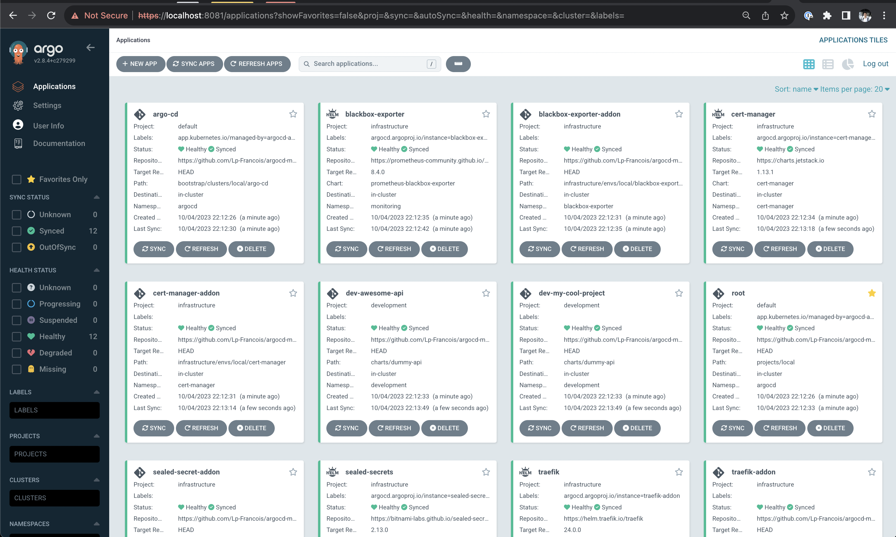

# Kubernetes infrastructure with ArgoCD 🐙☸️

Include multi-tenancy, local setup, bootstrap script and more.



## Getting started 🚀

```sh
# start local cluster (https://kind.sigs.k8s.io/)
kind create cluster --wait 5m --config=./scripts/kind/kind-config.yaml

# bootstrap argocd on the cluster
./scripts/bootstrap.sh --cluster=local

# Note: I only tested on Mac with docker desktop 😁
```

## Commands 💻

```sh
./scripts/bootstrap.sh --help

./scripts/lint-helm.sh
./scripts/lint-helm-stagged.sh
```

## Inspirations

Repo to show some ideas on how to deploy infrastructure & apps in a gitops fashion, with ArgoCD.

- https://github.com/fluxcd/flux2-multi-tenancy
- https://github.com/kostis-codefresh/gitops-environment-promotion
- https://github.com/argoproj-labs/argocd-autopilot
